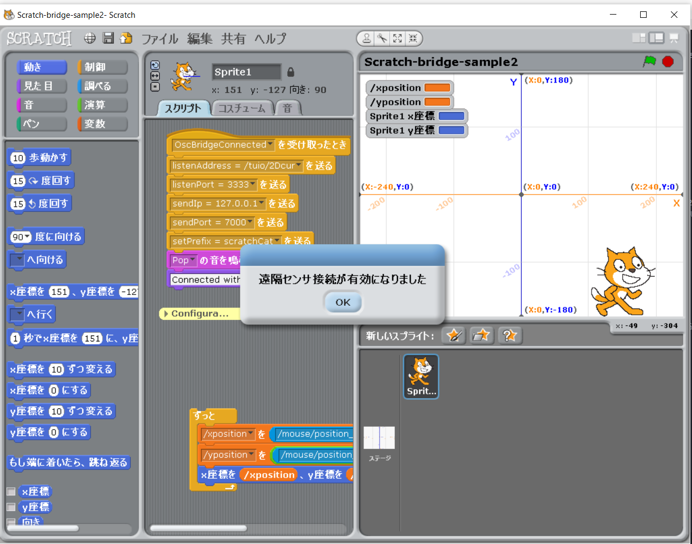
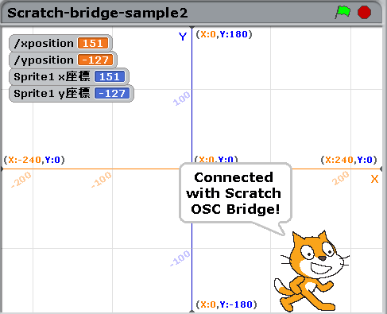
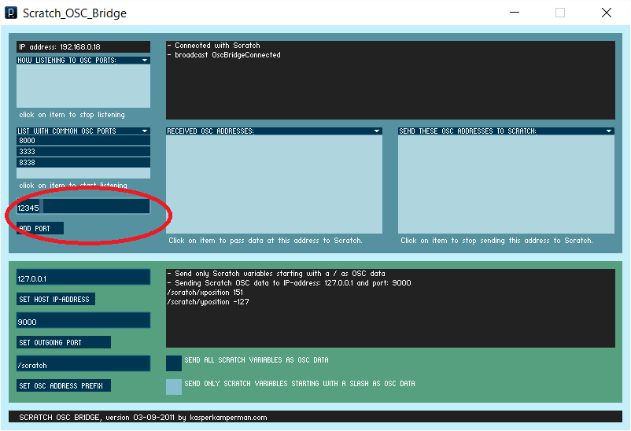
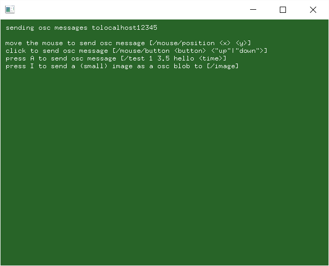
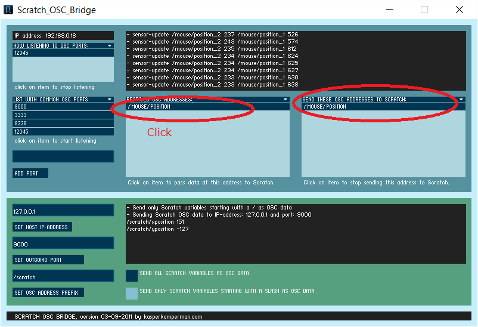
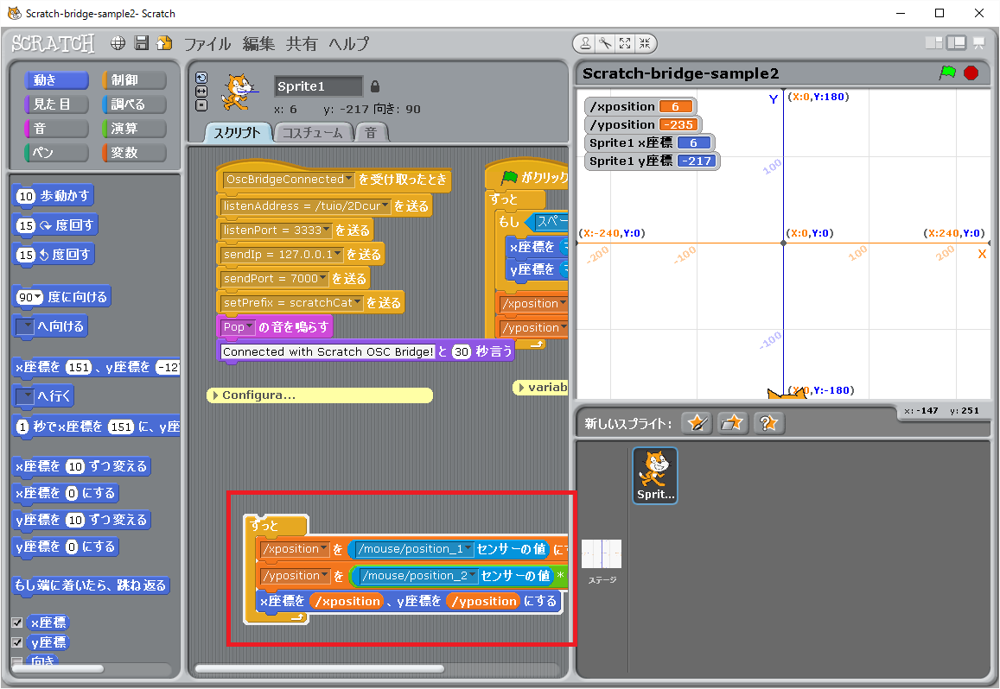
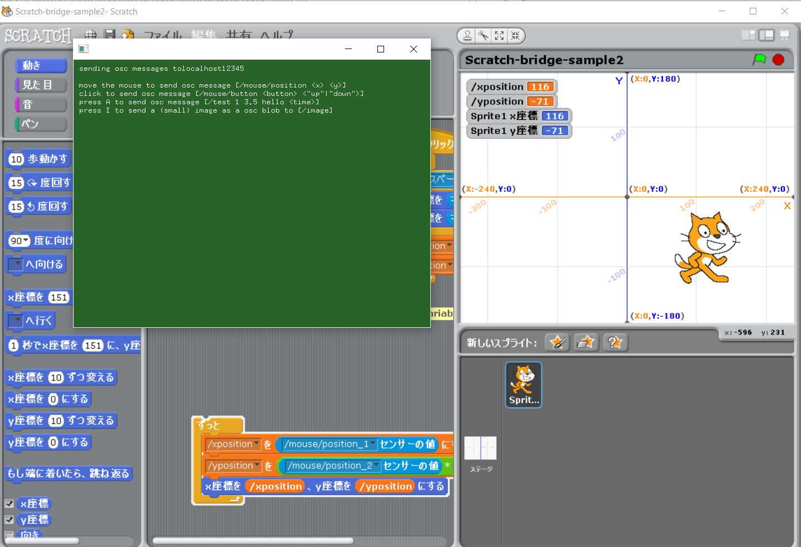

# ScratchOscSetupAndTest

## Scratchを使ってOSCで通信させるまでのセットアップとテストの手順

### 環境構築

#### Sccratch 1.4のインストール
今回はPepperや他のマシンと通信させるので1.4を使います。こちらからダウンロード。　　
https://scratch.mit.edu/scratch_1.4/

#### Scratch OSC Bridgeのインストール
ScratchとPepperや他のマシンとはOSCというプロトコルを使って通信させます。
その通信を仲介してくれるのがcratch OSC Bridgeです。  
http://www.kasperkamperman.com/blog/scratch-osc-bridge/

Scratch OSC Bridgeはここからダウンロードできます。  
https://code.google.com/archive/p/osc-tools/downloads

Windowsの方　-> Scratch_OSC_Bridge.windows.zip  
Macの方　-> Scratch_OSC_Bridge.macosx.zip

#### javaのインストール
Scratch OSC Bridgeをインストールして、\Scratch_OSC_Bridge.windows\Scratch_OSC_Bridge.windows\application.windows32\Scratch_OSC_Bridge.exeを実行すると、「javaw.exeが見つかりません」というエラーが出た人はJavaがインストールされていないので、こちからJavaをダウンロードしてインストール  
http://www.java.com/ja/

#### OSC送信テストプログラムのダウンロード
Windoows向けにOSCのメッセージを送るプログラムを作っておきました。  
https://github.com/naojitaniguchi/OSCSenderToLocal/releases/tag/v1  
こちらからOSCSender.zipをダウンロードしてください。

ここでScratchでOSCを使ってみる環境が整ったので、Scratchと外部プログラムを
OSCで通信させてみます。

#### ScratchでOSCの受信をするサンプルダウンロード
ScratchでOSCのメッセージを受信をするサンプルを作っておきました。  
https://github.com/naojitaniguchi/ScratchOscBrigdeSample/releases/tag/v1  
こちらからScratch-bridge-sample2.zipをダウンロードしてください。  
ダウンロードしたら展開をします。Scratch-bridge-sample2.sbを使います。

### 通信テスト
#### Scratchの起動
Scratchを起動してダウンロードしたScratch-bridge-sample2.sbを開きます。  
プロジェクトの開き方 -> ファイル/開く

Scratchのリモートセンサーについての詳しい解説  
http://blog.champierre.com/1047

#### Scratch OSC Bridgeの起動
Scratch OSCを展開したフォルダの Bridge\Scratch_OSC_Bridge.windows\Scratch_OSC_Bridge.windows\application.windows32\Scratch_OSC_Bridge.exe
を起動、application.windows64は何故か動かなかったので32bit版を使います。

接続されるとScratchから「ぽん」と音がなり"Connected with Scratch OSC Bridge"と表示されます。　　

#### OSCポートの追加
外部のプログラムと通信させる為のポートを追加します。ADD PORTの上に12345を入力、ADD PORTボタンをクリック。

#### OSC送信のプログラムを起動
ダウンロードしたマウスの位置をOSCで送るテストプログラムを起動します。  
OSCSender.zipを展開したbin/oscSenderExample.exeを起動します。

#### ScratchにOSCのメッセージを送信する設定
RECEIVED OSC ADDRESSES から /MOUSE/POSITION をクリック  
SEND THESE OSC ADDRESSES TO SCRATCH に /MOUSE/POSITIONが追加される

#### ScratchでOSCのメッセージを受信開始
Scratchのセンサーの値を受ける部分をダブルクリック

#### 接続完了
oscSenderExampleの上でマウスを動かすと、マウスの位置がOSCでScratchに送られて、ネコが動く  
OSCで送られた値は変数/xposition, /ypositionとして表示されています。

